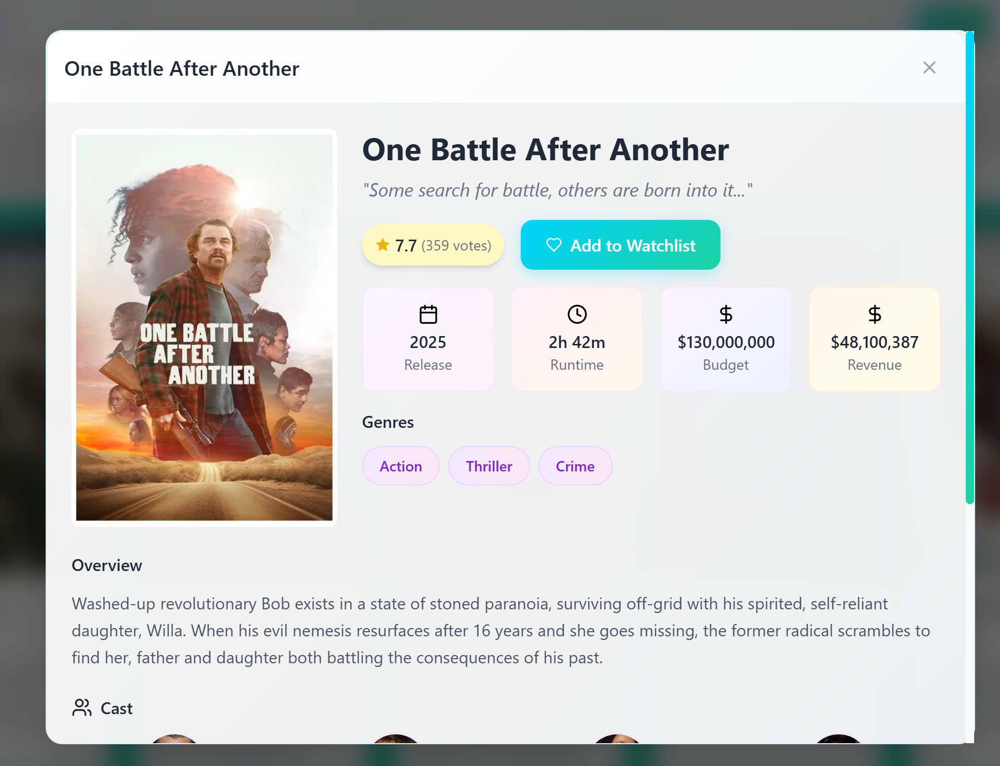
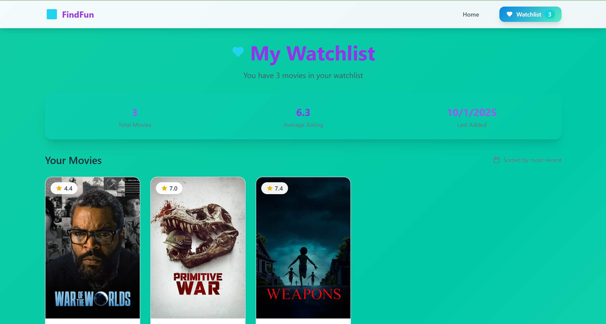

🎬 FindFun

A simple and interactive movie discovery website built with React, Vite, Tailwind CSS, and TMDB API.
FindFun allows users to search for movies, view their ratings, and add favorites to a personal wishlist.

📌 Features

🔍 Search Movies – Find movies by title using TMDB’s powerful search API.

⭐ Movie Ratings – Instantly view ratings fetched from TMDB.

❤️ Wishlist Movies – Save favorite movies to your wishlist for quick access.

⚡ Fast & Responsive – Built with Vite + Tailwind CSS for speed and modern styling.

🎥 Clean UI – Simple, user-friendly interface for smooth browsing.

🛠 Tech Stack

⚛️ React – Frontend framework.

⚡ Vite – Fast bundler & development server.

🎨 Tailwind CSS – Utility-first styling.

🎬 TMDB API – Movie database & ratings.

📂 Project Structure
FindFun/
├── src/
│   ├── components/    # Reusable UI components
│   ├── pages/         # Page-level components (Home, Wishlist, etc.)
|   ├── context/       # State/ contect provider
|   ├── types/         #Types of content
|   ├── services/      #API calls, Fetch logic
│   ├── App.jsx        # Root component
│   ├── main.jsx       # Entry point
│   └── styles.css     # Tailwind styles
├── public/            # Static assets
├── package.json
├── vite.config.js
└── README.md

🚀 Getting Started
1️⃣ Clone the repo

2️⃣ Install dependencies
npm install

3️⃣ Get a TMDB API Key

Create a free account on TMDB
.

Go to Settings → API and generate an API key.

4️⃣ Add API Key

Create a .env file in the project root:

VITE_TMDB_API_KEY=your_api_key_here

5️⃣ Run the development server
npm run dev

🎯 Usage

Enter a movie name in the search bar.

See movie details with ratings.

Click Wishlist to save movies you like.

Access your wishlist page anytime.

📊 Future Enhancements

🎞 Movie trailers preview.

👤 User authentication for personal wishlists.

🏷 Genre filters & recommendations.

📱 Mobile app version with React Native.

🤝 Contributing

Pull requests are welcome! Please open an issue first to discuss what you’d like to change.

🙏 Acknowledgements

🎬 TMDB (The Movie Database)
 – For providing free access to their movie data and ratings.

⚛️ React
 – For powering the frontend framework.

⚡ Vite
 – For the blazing fast build tool and dev server.

🎨 Tailwind CSS
 – For utility-first and responsive styling.

🖥 Open-source community – BOLT.AI

📸 Snapshots:-
 Full page-
  

  Pop-up page-
  
  
  Wishlist page-
  